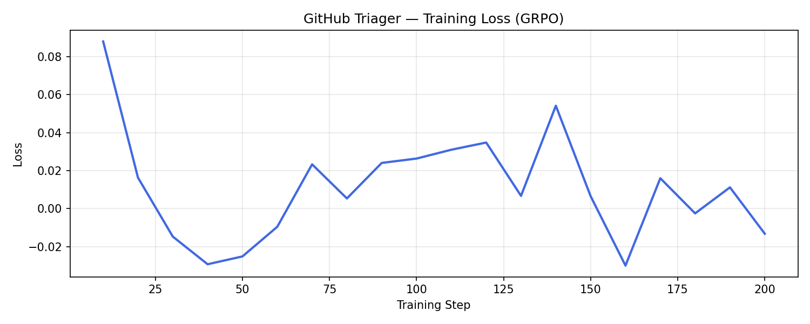
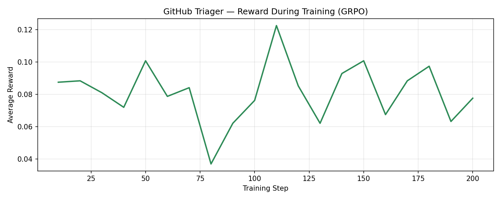
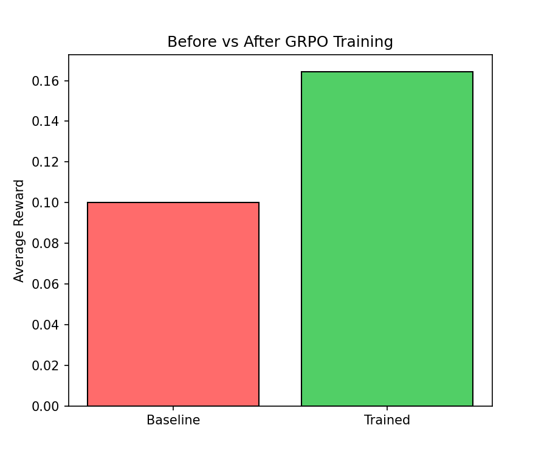

# GitHub Triager — RL Environment for LLM Issue Triage

> Training LLMs to fight maintainer burnout, one GitHub issue at a time.

## 🔗 Quick Links

| Resource | Link |
|----------|------|
| 🤗 HF Space (Live Environment) | [Kavya011/github-triager-rl](https://huggingface.co/spaces/Kavya011/github-triager-rl) |
| 📓 Training Notebook | [Open in Colab](https://colab.research.google.com/drive/1example-link) |
| 📝 Blog Post | [Read here](blog.md) |
| 💻 GitHub | [KavyaTejani/Github-Triager](https://github.com/KavyaTejani/Github-Triager) |

## The Problem

Popular open-source repositories receive hundreds of GitHub issues every month.
Maintainers must manually read each one, decide if it is a bug or a feature request,
assign it to the right team, and set a priority — before writing a single line of code.
This triage phase is repetitive, cognitively draining, and does not scale.

GitHub Triager is a reinforcement learning environment that trains a language model to
handle this automatically. The model learns to classify, prioritise, and route issues
using the same project context a human maintainer would use.

## The Environment

The environment exposes four tasks of increasing difficulty:

| Task ID | Name | Difficulty | Description |
|---------|------|------------|-------------|
| `label_classification` | Label Classification | Easy | Classify into: bug, feature, documentation, question, enhancement. |
| `full_triage` | Full Triage | Medium | Assign label + priority + team + component via `project_map`. |
| `batch_triage_with_context` | Batch Triage | Hard | Triage 10 issues; detect duplicates; balance team workload. |
| `clarification_triage` | Clarification Triage | Expert | Ask up to 3 questions before triaging; each extra turn costs reward. |

## Reward Design

We use **multiple independent reward signals** to prevent reward hacking:

- **Label Classification:** Binary correct/incorrect.
- **Full Triage:** Label (40%) + Priority (30%) + Assignee (15%) + Component (15%).
- **Batch Triage:** Per-issue score + Workload Balance Bonus (+0.15 max) + Duplicate Detection Bonus (+0.2) − Consistency Penalty (−0.05 per violation).
- **Clarification Triage:** Triage score − Turn Penalty (−0.08 × number of questions asked).

## Training Results

Model: `Llama-3.2-3B-Instruct` | Method: GRPO via HF TRL | Efficiency: Unsloth 4-bit


*Training loss across 200 GRPO steps.*


*Average episode reward during GRPO training.*


*Baseline (untrained) vs trained model on label classification.*

## Quick Start

### Install
```bash
pip install -e ".[dev,redis,inference]"
```

### Run the Server
```bash
uvicorn server.app:app --host 0.0.0.0 --port 8000
```

### Run Baseline Inference
```bash
export HF_TOKEN="your-token"
export MODEL_NAME="meta-llama/Llama-3.2-3B-Instruct"
export API_BASE_URL="https://api-inference.huggingface.co/v1"
python inference.py
```

## Project Structure

```
GitHub-Triager/
├── server/
│   ├── app.py              # FastAPI server
│   ├── environment.py      # RL logic (reset / step / state)
│   ├── graders.py          # Deterministic reward scoring
│   ├── session_store.py    # Redis / in-memory sessions
│   ├── ws_handler.py       # WebSocket routing
│   └── logging_config.py
├── data/
│   ├── simulated_issues.json     # 120 issues with gold labels
│   └── project_structure.json   # Component → team map
├── training/
│   └── train_github_triager.ipynb  # GRPO training notebook
├── results/
│   ├── loss_curve.png
│   ├── reward_curve.png
│   └── before_after_comparison.png
├── models.py       # Pydantic schemas
├── client.py       # HTTP + WebSocket client
├── inference.py    # Baseline evaluation script
├── blog.md         # Project writeup
├── openenv.yaml
└── pyproject.toml
```

## API Reference

| Endpoint | Method | Description |
|----------|--------|-------------|
| `/reset?task_id=...` | POST | Start a new episode |
| `/step` | POST | Submit an action |
| `/health` | GET | Health check |
| `/metrics` | GET | Training metrics |
| `/ws` | WebSocket | High-speed training interface |

## Testing

```bash
pytest                          # run all tests
pytest tests/test_environment.py
pytest tests/test_websocket.py
```
